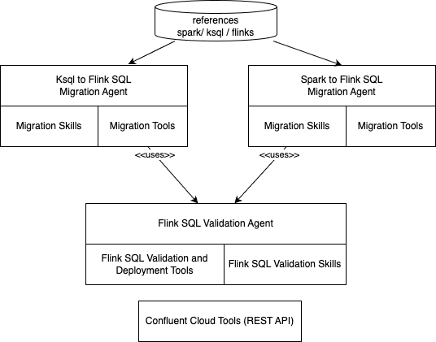
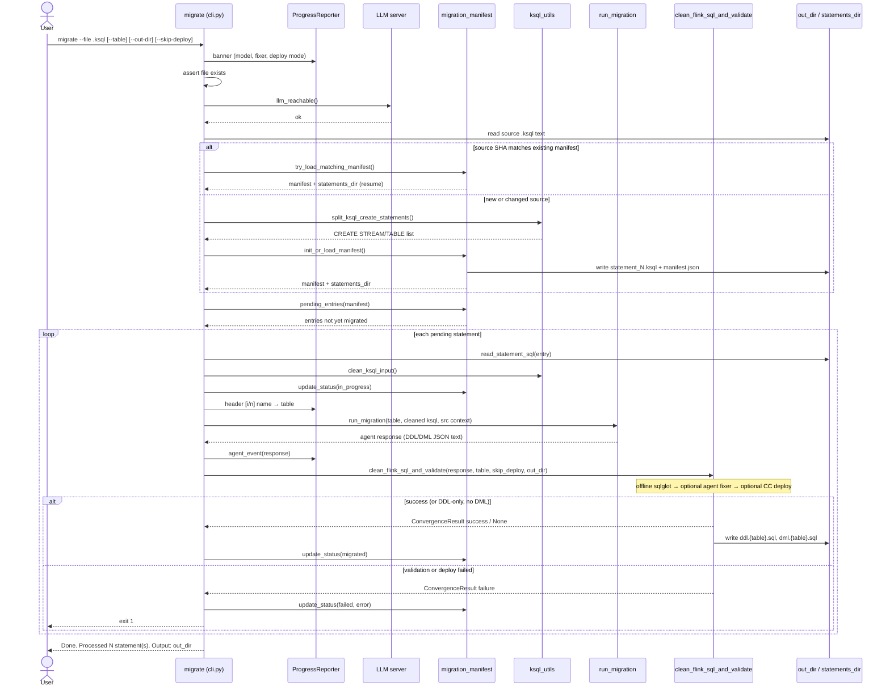

# Developer Guide

This section addresses notes and how to for supporting this project.

## Components

The following image illustrates the components involved in this solution, which matches the top level folders of the repository




### Flink-skill-common

The role of this component is to process the generated Flink SQL with static analysis and deployment using Confluent Cloud for Flink REST API and to offer a set of common tools, used for migration.

Statement **lifecycle** (create, wait, delete, exceptions, classify) lives in **`cc-tools`** (`cc_deploy.statement_lifecycle`). `flink-skill-common` depends on that package and keeps migration orchestration (`deploy_table`, MCP/LLM tools, convergence).

| Important Features | Code | Principles |
| ------ |-------|-----------|
| **Centralize configuration, logs, load ,env** | config.py | Common skill and specific skill loading |
| **Factory to build agno agents** | agents.factory.py | |
| **Agent for fixing Flink SQL syntax validation and deployment failures.** | cc_deployment_fixer.py| Uses cc-tools statement lifecycle + LLM to fix errors and save results to target folder |


* Unit tests without backends
    ```sh
    cd flink-skill-common/harness
    uv run pytest -vs tests/ut
    ```
* For integration tests, be sure the LLM server is reachable.
    ```sh
    uv run pytest -vs tests/it/
    ```

* Use as a standalone tool to validate and fix an existing Flink SQL

### cc-tools

Reusable Confluent Cloud Flink deploy library and CLIs (`cc_deploy`). Prefer calling `statement_lifecycle` from Python rather than duplicating confluent-sql REST logic in skill harnesses.


### ksql-to-flink CLI migrate flow

The `ksql-flink-migrate` command (`cli.py`) migrates one CREATE statement at a time. 

```sh
uv run ksql-flink-migrate --file routing.sql --out-dir ../staging/
```

But it can load a file with multiple create tables or streams and with some DML logic. If so, it will split the files in multiple separate files with a manifest to track the migration process. 

```sh
└── terminal_history.statements
        ├── 001_SHIP_REFERENCES.ksql
        ├── 002_SHIP_DETAILS.ksql
        └── manifest.json
```

Cli is reentrant and resumes from the file in the manifest where the source SHA is changed. 

```json
  "statements": [
    {
      "index": 1,
      "name": "ship_refs",
      "file": "001_SHIP_REFERENCES.ksql",
      "table": "shit_refs",
      "status": "migrated",
      "error": null,
      "updated_at": "2026-07-21T02:07:19.104550+00:00"
    },
```



### Processing flow for Flink SQL validation

```mermaid
sequenceDiagram
    participant Loop as converge_flink_sql
    participant Offline as sqlglot
    participant Agent as LLM_agent
    participant Remote as CC_Flink
    participant Deploy as deploy_table

    Loop->>Offline: attempt 1
    Offline-->>Loop: DML error INSRT
    Loop->>Agent: fix offline errors
    Agent-->>Loop: corrected DML
    Loop->>Offline: attempt 2
    Offline-->>Loop: pass
    Loop->>Remote: validate_statements_remote
    Remote-->>Loop: DDL invalid format
    Loop->>Agent: fix remote errors
    Agent-->>Loop: corrected DDL
    Loop->>Offline: attempt 3
    Offline-->>Loop: pass
    Loop->>Remote: pass
    Loop->>Deploy: deploy_table
    Deploy-->>Loop: success
```
