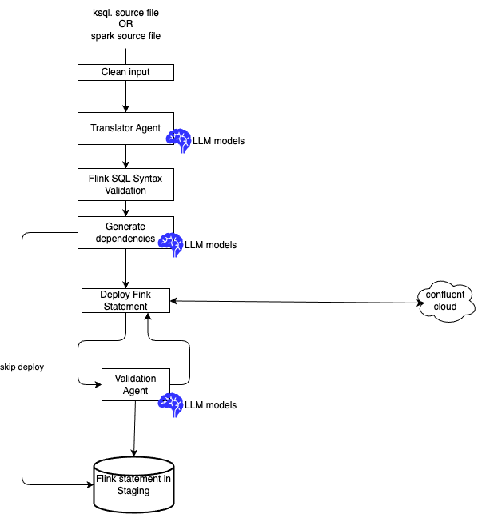

# Lab: Migration using AI

The current AI based migration implementation supported by this tool enables migration of:

* Spark SQL to Flink SQL
* ksqlDB to Flink SQL

The approach uses LLM agents local or remote. After this lab you should be able to use the `migration-to-flink` tools to partially automate your SQL migration to Flink SQL.

The core idea is to leverage LLMs and parser tools to understand the source SQL semantics and to translate them to Flink SQLs. 



And validate with Confluent Cloud deployment. 

**This github repository is not production ready, the LLM can generate hallucinations, and one to one mapping between source like ksqlDB or Spark to Flink is sometime not the best approach.** We expect this agentic solution will be a strong foundation for better results, and can be enhanced over time.

**Migration** is a one time shot, and should not be a practice to develop Flink solution.

???+ warning "Lab Environment"
	The Lab was developed and tested on Mac M3 and M5.

## Prerequisites

Be sure to have done the [Setup Lab](setup_lab.md) and [Setup script](https://github.com/jbcodeforce/migration-to-flink-skills/tree/main/scripts/setup.sh) to get different CLIs operational and generate Cursor/Claude skill variants from the canonical Agno `skill/` directories.

## Different runtimes

The goal is to try to limit cost and expose logic to SaaS LLM inference. For that smaller model, open weights, can be run locally to computer with at least 32GB of memory. Specially the Mac with their memory architectyure share with GPUs.

Running local, leverages [Agno](https://docs.agno.com/) framework. Skill are defined to be adapted if user wants to use Claude Code or Cursor. 

**Agno harness (CLI)** — translation and validation run via Python agents and `ksql-flink-migrate` / `spark-flink-migrate` CLIs. The harness loads `skill/SKILL.md` directly. Flink SQL validation uses `flink-skill-validate` or skill scripts under `flink-skill-common/skill/scripts/`.

**Cursor (IDE)** — skills under `.cursor/skills/` are generated with MCP-oriented instructions. **You** (the IDE assistant) translate SQL using the skill rules. Validation and deploy use the `flink-skill-common` MCP server (`validate_flink_sql_offline`, `create_flink_statement`, etc.). Do **not** run `ksql-flink-migrate` or `spark-flink-migrate` in the IDE workflow. 

**Claude Code (IDE)** — skills under `*/.claude/skills/`. **You** translate SQL using the skill rules. Validation uses `flink-skill-validate` CLI or bundled `validate_offline.py` scripts. Deploy uses the `flink-skill-common` MCP server when configured (`flink-skill-mcp`). Do **not** run Agno migration CLIs for IDE translation.

After editing any canonical `skill/SKILL.md`, run `./scripts/adapt-skills.sh --target cursor` and/or `./scripts/adapt-skills.sh --target claude` before using IDE workflows.


## Setup

Assume [Setup Lab](./setup_lab.md) has already run (`./scripts/setup.sh`). This script generates Claude and Cursor skills,  copied under each package's `.claude/skills/` or `.cursor/skills`.

* When skills are modified in one of the following sources

| Skill file | Role |
| -----------| ---------- |
| **flink-skill-common/skill/validate-flink-sql/SKILL.md** | Used with tools to deploy a fink statement to Confluent Cloud and fix issues with Agent | 
| **flink-skill-common/skill/source-ddl/SKILL.md** | It is possible that a statements fails because dependent tables are not present in Confluent Claude, this skill helps LLM to find the definition of those tables and create DDL for testing. | 
| **ksql-to-flink-skill/skill/SKILL.md** | Specific for ksql to flink sql migration |


### Claude Code integration

This section covers two skill scopes: Flink SQL validation and ksqlDB to Flink migration. Skills provide agent playbooks; CLIs run deterministic checks and translation.

| Scope | Skill | Package | Generated Claude path |
|-------|-------|---------|------------------------|
| Flink SQL validation | `/validate-flink-sql` | [`flink-skill-common`](https://github.com/jbcodeforce/migration-to-flink-skills/tree/main/flink-skill-common/) | `flink-skill-common/.claude/skills/validate-flink-sql/` |
| ksqlDB to Flink migration | `/ksql-to-flink` | [`ksql-to-flink-skill`](https://github.com/jbcodeforce/migration-to-flink-skills/tree/main/ksql-to-flink-skill/) | `ksql-to-flink-skill/.claude/skills/ksql-to-flink/` |
| spark SQL to Flink migration | [`spark-to-flink-skill`](https://github.com/jbcodeforce/migration-to-flink-skills/tree/main/spark-to-flink-skill/) | `spark-to-flink-skill/.claude/skills/spark-to-flink/` |


## Commands

### Ksql to Flink

* Get the last CLI documentation
  ```sh
  ./scripts/run-migration.sh --help
  ```
* Migrate ksql statements included in one file, without Confluent Cloud deployment:
  ```sh
  ./scripts/run-migration.sh --file ksql-statements.sql --out-dir ../project/staging 
  ```

## Scope 1: Flink SQL validation

### Happy path

Use when you already have Flink DDL and/or DML and need syntax checks or convention fixes, and deployment using Confluent Cloud.

#### CLI (from repo root):

```bash
cd flink-skill-common/harness && uv sync --extra dev

uv run flink-skill-validate offline \
  --ddl ../../references/flink/valid/raw_classical_songs/ddl.raw_classical_songs.sql \
  --dml ../../references/flink/valid/raw_classical_songs/dml.raw_classical_songs.sql
```

The CLI prints JSON with `"ok": true/false` and an `issues` array. Exit code 0 means pass; 1 means validation errors.

#### Claude Code

Start `claude` code under the `references/flink` folder.

> Load the `validate-flink-sql` skill. Run `flink-skill-validate offline`. on the Flink SQL in valid/filtering/ . If validation fails, apply the skill rules, write corrected SQL, and re-run until `ok` is true.

You should get a response like:
```sh
Validation passed on the first run — no fixes needed.

Result:
{
  "ok": true,
  "issues": [],
  "error_count": 0
}

I loaded the validate-flink-sql skill and ran flink-skill-validate offline on the two Flink SQL files in valid/filtering/:

- ddl.filtered_pub.sql — CREATE TABLE filtered_publications (has PRIMARY KEY ... NOT ENFORCED, DISTRIBUTED BY HASH(book_id), and standardized connector properties)
- dml.filtered_pub.sql — INSERT INTO filtered_publications ... SELECT ... WHERE author = 'George R. R. Martin'

Both are syntactically valid per the offline (sqlglot Flink-dialect) check: ok is true with zero issues. No corrections were required, so no re-run was needed. These files live under valid/, so passing is the expected outcome.
```


### Invalid DML or DDL

Validate broken DML from [`references/flink/invalid/dml_bad_syntax/`](https://github.com/jbcodeforce/migration-to-flink-skills/tree/main/references/flink/invalid/dml_bad_syntax/) (contains an `INSRT INTO` typo):

#### CLI

```bash
cd flink-skill-common/harness
uv run flink-skill-validate offline --dml ../../references/flink/invalid/dml_bad_syntax/dml.sql
```

**Expected:** exit code 1 and a json like:
```json
{
  "ok": false,
  "issues": [
    {
      "statement_index": 0,
      "kind": "dml",
      "message": "DML must start with INSERT INTO",
      "line": null,
      "severity": "error"
    }
  ],
  "error_count": 1
}
```

#### Claude Code
**Follow-up:** Ask Claude to fix the DML using `validate-flink-sql` rules and re-run validation until it passes.

```sh
using /validate-flink-sq assess invalid/dml_bad_syntax/dml.sql
```

you should get something like:
```sh
Validation failed — as expected for this invalid/ fixture.

File: invalid/dml_bad_syntax/dml.sql
INSRT INTO raw_classical_songs(artist, title) VALUES ('Test Artist', 'Test Title');

Result:
{
  "ok": false,
  "issues": [
    {
      "statement_index": 0,
      "kind": "dml",
      "message": "DML must start with INSERT INTO",
      "line": null,
      "severity": "error"
    }
  ],
  "error_count": 1
}

Assessment: The statement's keyword is misspelled — INSRT instead of INSERT — so the validator rejects it as not starting with INSERT INTO. The corrected form would be:

INSERT INTO raw_classical_songs (artist, title) VALUES ('Test Artist', 'Test Title');

Since this lives under invalid/ (a negative test fixture meant to fail), I've left it unchanged and only reported the finding. Let me know if you'd like me to write the corrected version somewhere.
```

???+ tip "Alternative invalid fixture"
	For validating a DDL syntax error instead, use [`references/flink/invalid/ddl_bad_syntax/ddl.sql`](https://github.com/jbcodeforce/migration-to-flink-skills/tree/main/references/flink/invalid/ddl_bad_syntax/ddl.sql) with `--ddl` only. Expect `"kind": "ddl"` in the issues.

### Deploy failure fix loop

Use when Flink SQL is deployed to Confluent Cloud and a statement fails or is unhealthy. The **host assistant** performs the fix loop using the `validate-flink-sql` skill — not the Agno `FlinkSqlDeployFixerAgent`.

Requires `FLINK_*` credentials in repo `.env` and MCP enabled (Cursor) or `flink-skill-mcp` configured (Claude Code).

#### Cursor

> Load `validate-flink-sql`. For failed statement `{table}-dml`, call MCP `get_flink_statement_exceptions`, fix DDL/DML using skill rules, re-validate with `validate_flink_sql_offline`, then redeploy source DDLs, target DDL, and target DML.

#### Claude Code

> Load `validate-flink-sql`. Call MCP `get_flink_statement_exceptions` on the failed statement. Fix SQL using skill rules, run `flink-skill-validate offline`, then redeploy via MCP `create_flink_statement` and `wait_flink_statement_phase`.

**Workflow:**

1. `get_flink_statement_exceptions` on the failed statement name.
2. Apply `validate-flink-sql` rules; update `ddl.{table}.sql`, `dml.{table}.sql`, and `tests/ddl.*.sql` stubs if needed.
3. Re-validate (`validate_flink_sql_offline` or `flink-skill-validate offline`).
4. Redeploy in order: source stub DDLs → target DDL → target DML.
5. `check_flink_statement_health` on DML; repeat until success or you stop.

Do **not** set `AGENT_FIXER_EXECUTION_ENABLED` or invoke Agno harness CLIs for IDE fixes.

---

## Scope 2: ksqlDB to Flink migration with CC validation

Use when converting ksqlDB `CREATE STREAM` / `CREATE TABLE` scripts to Flink DDL and DML.

The references/ksql/sources/routing includes the following ksql [from the Confluent.io  tutorial](https://developer.confluent.io/tutorials/):

```sh
├── references/ksql/sources/routing
│   ├── deduplicate.ksql
│   ├── filtering.ksql
│   ├── merge.ksql
│   └── splitting.ksql
```

#### CLI translation only

* Be sure to be in the ksql-to-flink-skill folder
* Run a migration for a unique table without CC deployment and validation.
  ```bash
  ./scripts/run-migration-sh --table dim_all_songs \
    --file ../../references/ksql/sources/routing/merge.ksql \
    --out-dir ../../staging/ksql-lab-out \
    --skip-deploy
  ```

* Run a migration with a file containing multiple ksql statements, with deployment to CC
  ```sh
  /scripts/run-migration-sh --file  
  ```


#### Agno harness: translation and deployment with fixer agent

Requires `AGENT_FIXER_EXECUTION_ENABLED=1` in `.env` and a reachable LLM (`SL_LLM_*`).

```sh
AGENT_FIXER_EXECUTION_ENABLED=1 uv run ksql-flink-migrate \
  --table dim_all_songs \
  --file ../../references/ksql/sources/routing/merge.ksql \
  --out-dir ../../staging/ksql-lab-out
```

This invokes `FlinkSqlDeployFixerAgent` (Agno) on validation or deploy failure — not the Cursor/Claude IDE workflow.

#### Claude Code

From the references folder, enter a prompt like:

> Load the `ksql-to-flink` skill. Migrate `ksql/sources/routing/deduplicate.ksql` for table `detected_clicks`. Write `ddl.detected_clicks.sql` and `dml.detected_clicks.sql` under `staging/ksql-lab-out/`. Then validate with `flink-skill-validate offline`.

**Workflow:**

1. Apply `ksql-to-flink` translation rules yourself (do **not** run `ksql-flink-migrate`).
2. Write `ddl.{table}.sql` and `dml.{table}.sql` under the output directory.
3. Run `flink-skill-validate offline` on the outputs (or MCP `validate_flink_sql_offline` in Cursor).
4. On errors, follow the **`validate-flink-sql` fix loop** (apply rules, re-validate).
5. Optional deploy: MCP tools from `flink-skill-common` (`create_flink_statement`, etc.) when Flink credentials are configured. On deploy failure, follow the same fix loop (Scope 1).

#### Cursor

> Load the `ksql-to-flink` skill. Migrate `ksql/sources/routing/deduplicate.ksql` for table `detected_clicks` to `staging/ksql-lab-out/`. Validate with MCP `validate_flink_sql_offline`.

Same workflow as Claude Code, but use MCP tools for validation and deploy instead of shell CLIs.

