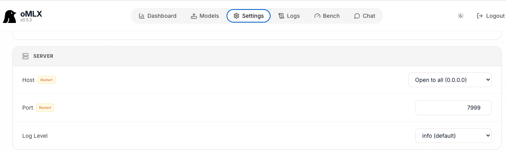

# Lab: Setup

Prepare the local environment for Agno-based migration CLIs (ksqlDB and Spark SQL to Flink SQL).

## Prerequisites

- macOS or Linux (lab tested on Mac)
- [uv](https://docs.astral.sh/uv/getting-started/installation/) on `PATH`
- Python 3.11+ (`uv python install 3.11` if needed)
- To run LLM locally, we tested only on Mac M4 and M5, running OpenAI-compatible LLM server (oMLX). If you use a second machine on LAN, expose oMLX server to listen on 0.0.0.0, port 7999. 
* Define the SL_LLM_BASE_URL endpoint in the `.env` to the ipaddress of the oMLX server.

## Run setup

From the repository root:

```bash
./scripts/setup.sh
```

The script will:

1. Check `uv` and Python 3.11+
2. Create `.env` from `.env.example` if missing
3. Run `uv sync --extra dev` in `flink-skill-common`, `ksql-to-flink-skill`, and `spark-to-flink-skill` harnesses
4. Verify Python packages, Agno agent construction, all CLI entry points, and LLM reachability
5. Generate Cursor skills under `.cursor/skills/` and Claude skills under `*/.claude/skills/` via `adapt_skills.py`

Re-run verification without reinstalling:

```bash
./scripts/setup.sh --skip-sync
```

## LLM configuration

### Use oMLX on Mac M3 to M5

* Install [oMLX](https://omlx.ai/) on local mac or a remote Mac on the same LAN
* `omlx start` 
* [localhost:8000/admin(http://localhost:8000/admin) 

* Change the settings: set the network to listen on port 7999 and all ip address, also set a key. 
    
* Restart the server: `omlx stop` then `omlx start`
* Download a model: from `hugging face` mlx model named: `Ornith-1.0-9B-6bit`

| Models Tested | Comments       |
| ------------- | -------------- |
| **Ornith-1.0-9B-6bit** | Run in 32GB RAMN. M3. Model in Hugging Face |
| **Qwen3.6-27B-PARO** |INT4 quantization close to FP16 in accuracy. Good at reasoning and coding. |

### Set environment variables

Edit the repo-root `.env` (or set `DOTENV_FILE` to an external file):

| Variable | Purpose |
|----------|---------|
| `SL_LLM_BASE_URL` | OpenAI-compatible API base (default is local `http://localhost:7999/v1`) |
| `SL_LLM_MODEL` | Model id from response of  `curl GET $SL_LLM_BASE_URL/models` |
| `SL_LLM_API_KEY` | API key if required by your server |

Setup **fails** if the LLM server is not reachable or the configured model is missing or has a context window below 8000 tokens. Start your local inference server before running setup.

## Optional: Flink deploy credentials

Translate-only runs use `--skip-deploy` and do not need Confluent Cloud credentials. For deploy, fill `FLINK_*` variables in `.env`.

```bash
cp .env.example .env
export DOTENV_FILE=/path/to/.env  # optional -- default is repository  .env
```

Fill LLM and Flink credentials in `.env`

## Verified CLIs

| CLI | Harness directory |
|-----|-------------------|
| `flink-skill-mcp`, `flink-skill-validate` | `flink-skill-common/harness` |
| `ksql-flink-migrate` | `ksql-to-flink-skill/harness` |
| `spark-flink-migrate` | `spark-to-flink-skill/harness` |

*Developer: see the `pyproject.toml` under flink-skill-common, ksql-to-flink-skill and spark-to-flink-skill*

## Skills: Agno vs Cursor/Claude Code

| Runtime | Skill source | Validation | Deploy fix on failure |
|---------|--------------|------------|------------------------|
| Agno harness / CLI | `skill/SKILL.md` (canonical) | `flink-skill-validate` CLI or `skill/scripts/validate_offline.py` | Agno `FlinkSqlDeployFixerAgent` when `AGENT_FIXER_EXECUTION_ENABLED=1` |
| Cursor | `.cursor/skills/` (generated) | MCP `validate_flink_sql_offline` on `flink-skill-common` server | Host assistant + `validate-flink-sql` fix loop via MCP |
| Claude Code | `.claude/skills` (generated) | CLI tools in skill | Host assistant + `validate-flink-sql` fix loop; MCP deploy when configured |

As a developer or for tuning the skill, edit the canonical `skill/SKILL.md`, then refresh the IDE skills:

```bash
./scripts/adapt-skills.sh --target cursor --install
./scripts/adapt-skills.sh --target claude --install
```

