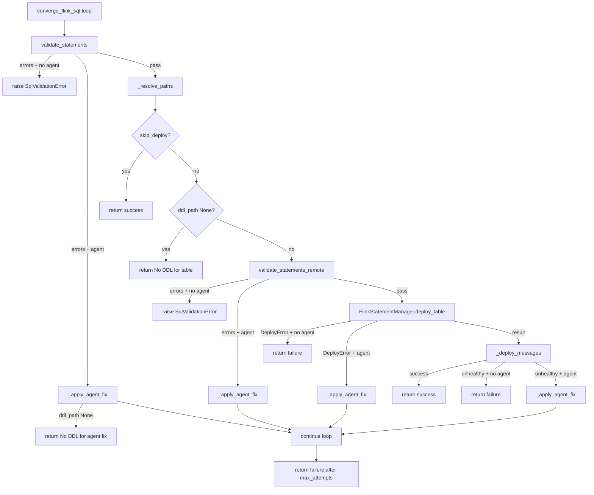

# flink-skill-common

Shared Python library for the ksql-to-flink and spark-to-flink migration. This component addresses the Flink SQL validation with agent and tools to validate SQL syntax and deployment to Confluent Cloud.

## Modules

| Module | Purpose |
|--------|---------|
| `response_io` | Parse LLM migration responses; write DDL/DML files |
| `llm` | OpenAI-compatible LLM reachability and model resolution |
| `config` | `HarnessContext`, LLM settings, `FlinkDeploySettings`, deploy preflight |
| `sql_parse` | Comment/DROP stripping, CREATE statement splitting, dependency analysis |
| `sql_validate` | Offline (sqlglot) and remote (confluent-sql) SQL syntax validation |
| `convergence` | Extract SQL from LLM output, validate, deploy, agent fix loop |
| `agents.factory` | Agno agent construction helpers |
| `agents.deploy_fixer` | Agno agent with confluent-sql tools for validation/deploy fixes |
| `deploy` | Confluent Cloud Flink deploy via confluent-sql REST driver |

## Convergence loop

`converge_flink_sql()` retries validation, deploy, and agent fix until SQL converges or max retries exhaust. See [references/flink/README.md](../references/flink/README.md) for staged multi-error fixtures and the full IT flow diagram.




## Environment

All harnesses load a shared `.env` from the monorepo root (`migration-to-flink-skills/.env`). Override the location with the `DOTENV_FILE` environment variable (absolute path, or relative to the repo root):

```bash
cp .env.example .env
export DOTENV_FILE=/path/to/reusable.env  # optional
```

Copy [../.env.example](../.env.example) to the repo root and fill in LLM and Flink credentials.

## MCP server (Cursor IDE)

Validate and deploy Flink SQL from Cursor using the `flink-skill-common` MCP server. The repo includes [`.cursor/mcp.json`](../.cursor/mcp.json); enable it in **Cursor Settings → MCP**.

Prerequisites:

```bash
cp .env.example .env   # repo root — Flink credentials + optional LLM settings
cd flink-skill-common/harness && uv sync --extra dev
```

The server loads credentials from the repo-root `.env` via `DOTENV_FILE=.env` (relative to the monorepo root).

| MCP tool | Purpose |
|----------|---------|
| `validate_flink_sql_offline` | sqlglot syntax check (no CC credentials) |
| `validate_flink_sql_remote` | Confluent Cloud Flink parser |
| `create_flink_statement` | Submit DDL or DML |
| `wait_flink_statement_phase` | Poll until RUNNING/COMPLETED/APPLIED |
| `get_flink_statement_exceptions` | Triage failed statements |
| `check_flink_statement_health` | Verify DML health |

Run manually:

```bash
cd flink-skill-common/harness && uv run flink-skill-mcp
uv run flink-skill-validate offline --ddl path/to/ddl.sql --dml path/to/dml.sql
```

## Skill layout (Agno-first)

Canonical skill content lives in [`skill/`](skill/) for Agno harnesses (`LocalSkills`). Cursor and Claude variants are **generated** — do not edit `.cursor/skills/` or `.claude/skills/` directly.

```bash
# From repo root after editing skill/SKILL.md
./scripts/adapt-skills.sh --target cursor
./scripts/adapt-skills.sh --target claude
# Install to user home (optional)
./scripts/adapt-skills.sh --target cursor --install
```

| Runtime | Skill source | Validation execution |
|---------|--------------|----------------------|
| Agno harness | `skill/` in place | `scripts/validate_offline.py` or `flink-skill-validate` CLI |
| Cursor / Claude | `.cursor/skills/` or `~/.cursor/skills/` | MCP `validate_flink_sql_offline` / `validate_flink_sql_remote` |

## Layout

All Python source, tests, and package metadata live under [`harness/`](harness/):

```
flink-skill-common/
├── harness/          # canonical package (pyproject.toml, src/, tests/)
│   ├── src/flink_skill_common/
│   └── tests/
├── skill/            # Agno canonical skill for validate-flink-sql
│   ├── scripts/      # validate_offline.py, validate_remote.py
│   └── references/
└── README.md
```

## Commands

From `flink-skill-common/harness`:

```bash
cd harness
uv sync --extra dev
uv run pytest -vs tests/ut
uv run flink-skill-mcp   # MCP server for Cursor (stdio)
uv run flink-skill-validate offline --ddl ddl.sql --dml dml.sql
```

For integration tests, it requires a reachable LLM and CC Flink deploy credentials in .env.

```sh
AGENT_FIXER_EXECUTION_ENABLED=true \
uv run pytest tests/it/test_convergence_it.py -vs -m integration_agent
```

## To use skill in Claude Code

* Prompts supported:
    ```sh
    using /validate-flink-sql  validate references/flink/invalid/dd_bad_syntax/ddl.sql and fix it until it deploys successfully on confluent cloud
    ```

