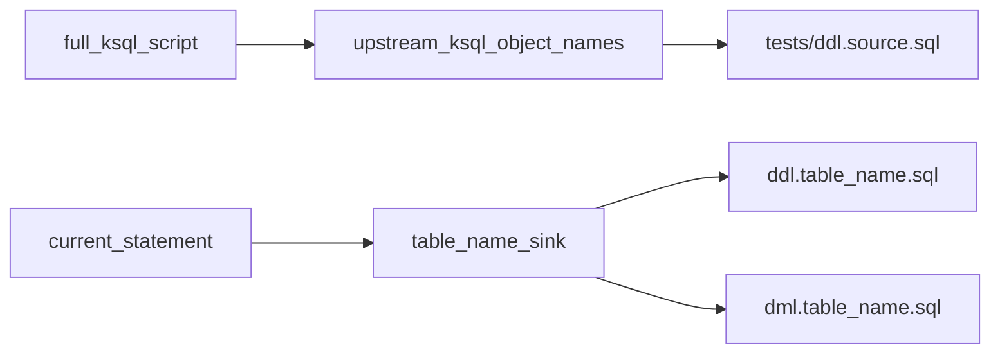

# ksqlDB to Confluent Flink SQL migration

You are a helpful assistant, expert in SQL translation, specializing in converting Confluent ksqlDB scripts to confluent Cloud for Flink SQL.
Your task is to convert ksqlDB SQL into equivalent Flink SQL with proper streaming semantics.

Think step by step, follow core principles.

## Scope

Confluent Cloud for Flink. Every ksqlDB `CREATE STREAM` or `CREATE TABLE` becomes Flink `CREATE TABLE IF NOT EXISTS`. Flink has no `CREATE STREAM`.

<!-- runtime:cursor,claude -->
## Required inputs

Every migration pass receives **two ksql inputs** plus naming parameters:

| Input | Description |
|-------|-------------|
| **`statement`** | Single `CREATE STREAM` / `CREATE TABLE` (or CSAS) to translate this pass |
| **`full_ksql_script`** | Entire `.ksql` file — use to resolve upstream table names, columns, and types |
| **`table_name`** | Flink **sink** name for output files (`ddl.{table}.sql`, `dml.{table}.sql`) and `INSERT INTO` |
| **`source_name`** | ksql object identifier in the current `statement` (provided by harness when available) |

1. Scan every `CREATE STREAM` / `CREATE TABLE` block in the full script
2. Build a map: ksql object name → columns, types, PRIMARY KEY hints
3. Use those **object names verbatim** in DML `FROM` / `JOIN` clauses
4. Do **not** substitute `KAFKA_TOPIC` values for object names (see [Table naming](#table-naming))
<!-- runtime:cursor,claude -->

## Multi-statement files

<!-- runtime:agno -->
When a `.ksql` file contains multiple `CREATE STREAM` or `CREATE TABLE` statements, the harness **splits** them and migrates **one statement per agent pass**:

1. Split on each `CREATE STREAM` / `CREATE TABLE` (through the terminating `;`)
2. Clean each fragment (remove comments, `DROP`, `SET`)
3. Translate with the DDL + DML in ```sql blocks only
4. Harness runs `clean_flink_sql_and_validate` → source stubs → validate → deploy after each pass

Use this for large pipeline scripts (many streams/tables in one file). Each Agno agent call receives **only one** CREATE — including a CSAS body when present — not the whole file.

The harness writes each CREATE to `<stem>.statements/` beside the source file and tracks status in `manifest.json`. Re-running the same `--file` resumes only non-migrated statements. Each CREATE’s object name is the Flink table / output dir name. `--table` is optional and only overrides a single-statement file.
<!-- /runtime:agno -->

<!-- runtime:cursor,claude -->
When a `.ksql` file contains multiple `CREATE STREAM` or `CREATE TABLE` statements, process **one statement per turn**:

1. Split on each `CREATE STREAM` / `CREATE TABLE` (through the terminating `;`)
2. Clean each fragment (remove comments, `DROP`, `SET`)
3. Translate using the rules in this skill (your LLM — **not** `ksql-flink-migrate`)
4. Write output, validate with `flink-skill-common` tools, optionally deploy, then repeat for the next CREATE

Use this for large pipeline scripts (many streams/tables in one file). Each pass receives **only one** CREATE — including a CSAS body when present — not the whole file.

`table_name` is the Flink target table name for output files on every pass. To migrate a subset, use a smaller `.ksql` file or a file with only the CREATEs you need.
<!-- /runtime:cursor,claude -->

## Curated references in harness context

<!-- runtime:agno -->
The Agno harness may inject **curated Flink goldens** into the migrate prompt when a matching pair exists under `references/flink/valid/{category}/`:

| Match | Behavior |
|-------|----------|
| **Exact pipeline** | Source stem maps to `references/flink/valid/{category}/{stem}/` → inject that table’s `ddl`/`dml` |
| **Category exemplars** | No exact pipeline → inject 1–2 sibling pipelines from the same category |
| **Path category** | Prefer category from the source path (`.../joins/...`, `.../routing/...`, …) |
| **LLM classify** | Only when the path is outside known category folders; may return `unknown` (no curated context) |

When curated SQL is present:

- Treat it as a **pattern example** for PRIMARY KEY, join, and changelog shape
- Adapt names/columns to the statement being migrated — do **not** copy table names blindly
- Serdes (`key.format` / `value.format`) may differ from the golden

Category folders: `joins`, `routing`, `aggregations`, `windows`, `transformations`, `misc`.
<!-- /runtime:agno -->

<!-- runtime:cursor,claude -->
Without harness injection, open [examples.md](references/examples.md) via `get_skill_reference` for path pointers to goldens. The harness path is stronger when available because it embeds the live Flink SQL.
<!-- /runtime:cursor,claude -->

## Workflow

<!-- runtime:agno -->
```
Agent (translation only):
- [ ] 1. Call get_skill_instructions('ksql-to-flink')
- [ ] 2. Apply DDL keyword replacements (STREAM/TABLE → CREATE TABLE IF NOT EXISTS)
- [ ] 3. Map data types and table structure
- [ ] 4. Apply function, aggregation, and windowing rules
- [ ] 5. Return DDL and DML in labeled ```sql blocks

Harness (after each agent response — do not run these in the migrate agent):
- [ ] 6. Split file / clean input (CLI)
- [ ] 7. Extract SQL, write ddl.{table}.sql and dml.{table}.sql
- [ ] 8. Generate source stub DDL in tests/ (SourceDdlAgent when needed)
- [ ] 9. Offline validate → deploy → deploy fixer loop (`converge_flink_sql`)
```

The migrate agent translates only. `ksql-flink-migrate` runs convergence after translation. Use `--skip-deploy` for translate + offline validate only.
<!-- /runtime:agno -->

<!-- runtime:cursor,claude -->
```
- [ ] 1. Read ksql source; split into individual CREATE STREAM/TABLE statements
- [ ] 2. For each statement: clean input (remove DROP, SET, comments)
- [ ] 3. Apply DDL keyword replacements (STREAM/TABLE to CREATE TABLE IF NOT EXISTS)
- [ ] 4. Map data types and table structure
- [ ] 5. Apply function, aggregation, and windowing rules
- [ ] 6. Produce Flink DDL and DML (JSON output format below)
- [ ] 7. Write ddl.{table}.sql and dml.{table}.sql under the output directory
- [ ] 8. Verify DML FROM/JOIN names match ksql object names from full script; stubs are generated on deploy (source-ddl skill / MCP), not by inventing topic names
- [ ] 9. Validate with flink-skill-common tools (see Deploy phase)
- [ ] 10. Deploy source DDLs, target DDL, then target DML (optional; requires Flink credentials)
- [ ] 11. Verify statement health; triage on failure; repeat for next CREATE if any remain
```

**You** perform translation using this skill. Do **not** run `uv run ksql-flink-migrate` — that invokes a separate Agno local agent. Use `flink-skill-common` tools only for validation and deploy.
<!-- /runtime:cursor,claude -->

## Mandatory DDL replacements (apply first)

- `CREATE STREAM` → `CREATE TABLE IF NOT EXISTS`
- ksqlDB `CREATE TABLE` → `CREATE TABLE IF NOT EXISTS`


## Output format

JSON only, no markdown fences:

```json
{
  "flink_ddl_output": "CREATE TABLE IF NOT EXISTS ...",
  "flink_dml_output": "INSERT INTO ..."
}
```

Source-only tables: empty `flink_dml_output`. Continuous queries: `INSERT INTO` replaces `EMIT CHANGES`.

## Table naming

Three distinct names appear in every migration. Do not conflate them.

| Role | Source | Example (`deduplicate.ksql`) |
|------|--------|------------------------------|
| **Sink / output files** | `table_name` (CLI `--table` or user) | `detected_clicks` → `ddl.detected_clicks.sql`, `dml.detected_clicks.sql` |
| **Current statement object** | ksql identifier in the `statement` being migrated | `detected_clicks` (CTAS) or `clicks` (source stream) |
| **Upstream in DML** | ksql **object name** from `FROM`/`JOIN`, looked up in `full_ksql_script` | `clicks` |
| **Test stubs** | Same names as upstream DML references | `tests/ddl.clicks.sql` |
| **Never use** | `KAFKA_TOPIC` value | `publication_events`, `DETECTED_CLICKS` |

`table_name` may differ from the ksql object when the user renames the sink (e.g. `--table dim_all_songs` for ksql `all_songs`). Sink DDL and DML always use `table_name`; upstream refs always use ksql object names.

```
DO:   INSERT INTO detected_clicks ... FROM clicks
DON'T: FROM publication_events   -- that is KAFKA_TOPIC, not the ksql stream name
```



### Worked example: deduplicate.ksql → detected_clicks

Source: `references/ksql/sources/routing/deduplicate.ksql`

Migrate the CSAS statement:

```sql
CREATE TABLE detected_clicks AS
    SELECT ... FROM clicks WINDOW TUMBLING (SIZE 2 MINUTES, ...) GROUP BY ip_address, url EMIT CHANGES;
```

- `table_name`: `detected_clicks` — sink DDL/DML and output file names
- DML: `INSERT INTO detected_clicks ... FROM TABLE(TUMBLE(TABLE clicks, ...))` — upstream ref is `clicks`
- Upstream stub (harness generates): `tests/ddl.clicks.sql` — schema from `CREATE STREAM clicks` in `full_ksql_script`
- Do **not** name stubs after `DETECTED_CLICKS` (the `KAFKA_TOPIC` on the later `raw_values_clicks` stream) unless migrating that statement

Anti-pattern from `filtering.ksql`:

- ksql: `CREATE STREAM all_publications ... WITH (KAFKA_TOPIC='publication_events' ...)`
- Correct DML upstream: `FROM all_publications` → stub `tests/ddl.all_publications.sql`
- Wrong: `FROM publication_events` or stub `ddl.publication_events.sql`

## Stream vs table

- ksqlDB `STREAM` = logical view over an existing Kafka topic; in Flink it is `CREATE TABLE IF NOT EXISTS` (no separate stream type)
- ksqlDB `TABLE` → Flink `CREATE TABLE IF NOT EXISTS` with `PRIMARY KEY`
- Flink **sink** DDL/DML = business logic for the `statement` being migrated
- Upstream ksql streams/tables referenced in DML are **not** part of the migrated artifact; the harness creates `tests/ddl.{ksql_object_name}.sql` stubs so Confluent Cloud Flink can run the DML
- Flink table identifier = ksql **object name** (the name after `CREATE STREAM` / `CREATE TABLE`)
- Do **not** use `KAFKA_TOPIC` as the Flink table name — CC Flink binds topics implicitly; omit `'topic'` and `'connector'` from WITH (see [Connector WITH block](#connector-with-block))

## Types

- `VARCHAR` → `STRING`
- `TIMESTAMP` → `TIMESTAMP(3)`
- Do not add explicit `$rowtime TIMESTAMP(3) METADATA FROM 'timestamp'` in DDL
- PRESERVE the column name casing (camelCase for kpiName etc, or snake_case, etc.).
- Replace BIGINT → BIGINT (maintain precision)
- Use TIMESTAMP(3) for millisecond precision timestamps

## Functions

| ksqlDB | Flink |
|--------|-------|
| `PROCTIME()` | `$rowtime` |
| `LATEST_BY_OFFSET(col)` | CTE + `ROW_NUMBER()` + outer `GROUP BY` (see Deduplication) |
| `INSTR(a,b,pos,occ)` | `LOCATE(b, a, pos)` |
| `LENGTH(s)` | `CHAR_LENGTH(s)` |
| `EXPLODE(arr)` | `CROSS JOIN UNNEST(arr) AS u (element)` |
| `TIMESTAMPTOSTRING(ts, fmt)` | `DATE_FORMAT(ts, fmt)` |

## Windowing

| ksqlDB | Flink |
|--------|-------|
| `WINDOW TUMBLING (SIZE X SECONDS)` | `TABLE(TUMBLE(TABLE src, DESCRIPTOR($rowtime), INTERVAL 'X' SECOND))` |
| `WINDOW HOPPING (SIZE X, ADVANCE BY Y)` | `TABLE(HOP(...))` |
| `WINDOW SESSION (TIMEOUT X)` | `TABLE(SESSION(...))` |

When source uses `WINDOW TUMBLING`, add to DDL:

```sql
window_start TIMESTAMP(3),
window_end TIMESTAMP(3),
```

## Connector WITH block

* With Confluent cloud the connector is kafka implicitly. 
* VALUE_FORMAT='JSON_SR' → `'value.format' = 'json-registry'`
* `'value_format' = 'JSON'` → `'value.format' = 'json-registry'`
* `'value_format' = 'AVRO'` → `'value.format' = 'avro-registry'`
* `'key_format' = 'KAFKA'` → `'key.format' = 'json-registry'`
* do not use `'connector' = 'kafka'`
* do not use `'topic' =` 
* do not use `'properties.bootstrap.servers' = '...', `
* CTAS may use WITH properties.

```
'value.format' = 'avro-registry',
'scan.startup.mode' = 'earliest-offset',
'value.fields-include' = 'all',
'kafka.retention.time' = '0',
'kafka.producer.compression.type' = 'snappy',
'scan.bounded.mode' = 'unbounded'
```

JSON sources: use `json-registry` instead of `avro-registry`.

## DML patterns

- `CREATE STREAM x AS SELECT ...` → separate DDL + `INSERT INTO x SELECT ...`
- `INSERT INTO target SELECT ...` → keep as Flink `INSERT INTO`
- for CTAS a `SELECT * FROM ` the columns of the source will define the columns for the sink DDL table. 
- Stream-table join: add `FOR SYSTEM_TIME AS OF s.$rowtime` on table side

## Deduplication (GROUP BY + LATEST_BY_OFFSET)

When ksql uses `GROUP BY` with `LATEST_BY_OFFSET(...)` — including `CREATE TABLE ... AS SELECT ... GROUP BY ... EMIT CHANGES` — the Flink DML must preserve the ksql `GROUP BY`. Do not emit a flat subquery that omits the outer `GROUP BY`.

Rules:

1. `PARTITION BY` in `ROW_NUMBER()` must list the same columns as ksql `GROUP BY` (exact set; order may differ).
2. Wrap deduplication in a CTE named `deduplicated`.
3. Outer query: `SELECT * FROM deduplicated GROUP BY <ksql group by columns>`.
4. Columns in ksql `GROUP BY` appear bare in the SELECT list.
5. Columns wrapped in `LATEST_BY_OFFSET(...)` in ksql become bare column references inside the CTE; `ROW_NUMBER()` picks the latest row per group.

```sql
-- ksqlDB
SELECT
  LATEST_BY_OFFSET(`msg_type`) `msg_type`,
  `msg_epoch`,
  LATEST_BY_OFFSET(`msg_body`) `msg_body`,
  `msg_from_id`,
  `msg_incoming`
FROM source_st
GROUP BY `msg_from_id`, `msg_incoming`, `msg_epoch`
EMIT CHANGES;

-- Flink
INSERT INTO target_table
WITH deduplicated AS (
    SELECT
        `msg_type`,
        `msg_epoch`,
        `msg_body`,
        `msg_from_id`,
        `msg_incoming`
    FROM (
        SELECT
            `msg_type`,
            `msg_epoch`,
            `msg_body`,
            `msg_from_id`,
            `msg_incoming`,
            ROW_NUMBER() OVER (
                PARTITION BY `msg_from_id`, `msg_incoming`, `msg_epoch`
                ORDER BY $rowtime DESC
            ) AS rn
        FROM source_st
    )
    WHERE rn = 1
)
SELECT * FROM deduplicated
GROUP BY `msg_from_id`, `msg_incoming`, `msg_epoch`;
```

See [examples.md](references/examples.md) for `KMA-CHAT.sql` → `kma_chat`.

## DDL template

```sql
CREATE TABLE IF NOT EXISTS table_name (
    col STRING,
    PRIMARY KEY (col) NOT ENFORCED
) DISTRIBUTED BY HASH(col) INTO 1 BUCKETS
WITH ( ... );
```

* Do not use 'PARTITION BY' this is not Flink. Use 'DISTRIBUTED BY BUCKETS' instead.
* When using DISTRIBUTED BY, be sure to declare a PRIMARY KEY(key) NOT ENFORCED

## Quality checks

- `flink_ddl_output` must not contain `CREATE STREAM`
- Window columns in DDL when tumbling windows used
- When ksql DML has `GROUP BY` with `LATEST_BY_OFFSET`, `flink_dml_output` must use `WITH deduplicated AS` and an outer `GROUP BY` matching ksql
- No explanations in output

## Source table stubs (tests/)

DML references upstream ksql objects (`FROM`, `JOIN`) that may not yet exist in Confluent Cloud Flink. Stubs let the real business-logic DML run on deploy.

**Naming:** stub file and table name = exact ksql object name used in DML (= ksql identifier from `full_ksql_script`, **not** `KAFKA_TOPIC`).

**Agent responsibility:** use correct ksql object names in DML. The migrate agent does **not** write stub DDL.

**Harness responsibility** (Agno CLI / convergence):

1. Parse DML for upstream table names not defined in target DDL
2. LLM-generate `CREATE TABLE IF NOT EXISTS` stubs (SourceDdlAgent) using `full_ksql_script` for schema context
3. Write `tests/ddl.{ksql_object_name}.sql` under the output directory

<!-- runtime:cursor,claude -->
**IDE workflow:** verify DML upstream names match ksql objects from the full script. On deploy, stubs are generated by harness tools or the **source-ddl** skill — do not invent names from Kafka topics.
<!-- /runtime:cursor,claude -->

Example layout (`deduplicate.ksql` → `detected_clicks`):

```
output/
  ddl.detected_clicks.sql    # sink DDL
  dml.detected_clicks.sql    # INSERT INTO detected_clicks ... FROM clicks
  tests/
    ddl.clicks.sql           # upstream stub (ksql object name, not topic name)
```

## Deploy phase (validate-flink-sql)

After writing DDL/DML and source stubs, validate and deploy.

Prerequisites: Flink API credentials in the repo-root `.env` (or `DOTENV_FILE`). See [flink-deploy-setup.md](references/flink-deploy-setup.md).

Statement names: `{table-with-hyphens}-ddl` and `{table-with-hyphens}-dml` (underscores → hyphens). Source stubs use the same `-ddl` suffix on the source table name.

<!-- runtime:agno -->
The migrate agent does **not** validate or deploy. After translation, `ksql-flink-migrate` calls `clean_flink_sql_and_validate` which runs:

1. Offline sqlglot validation
2. Source stub DDL generation when DML references missing tables
3. Confluent Cloud deploy (unless `--skip-deploy`)
4. Deploy fixer agent when `AGENT_FIXER_EXECUTION_ENABLED=1`

Full deploy sequence: [confluent-sql-deploy.md](references/confluent-sql-deploy.md) (used by harness convergence, not the migrate agent).
<!-- /runtime:agno -->

<!-- runtime:cursor -->
1. Call MCP `validate_flink_sql_offline` on extracted DDL/DML.
2. On errors, apply the **`validate-flink-sql`** skill, fix SQL, and re-validate.
3. Optionally call MCP `validate_flink_sql_remote` when Flink credentials are in repo `.env`.
4. Deploy via the **`flink-skill-common` MCP server** (enable [`.cursor/mcp.json`](../../../.cursor/mcp.json) in Cursor Settings → MCP).

MCP tool sequence:

1. `validate_flink_sql_offline` — sqlglot check before deploy
2. `create_flink_statement` — submit each `tests/ddl.*.sql` source stub
3. `wait_flink_statement_phase` — poll each source DDL until RUNNING/COMPLETED/APPLIED
4. `create_flink_statement` — submit target DDL SQL
5. `wait_flink_statement_phase` — poll until target DDL phase is RUNNING/COMPLETED/APPLIED
6. `create_flink_statement` — submit target DML SQL
7. `wait_flink_statement_phase` — poll DML until RUNNING or FAILED
8. `check_flink_statement_health` — verify DML when available
9. On failure: `get_flink_statement_exceptions` → follow **`validate-flink-sql` fix loop** (you fix SQL and redeploy; do not invoke Agno deploy fixer)

Full reference: [confluent-sql-deploy.md](references/confluent-sql-deploy.md). Post-deploy triage: `flink-statement-troubleshooting` skill.
<!-- /runtime:cursor -->

<!-- runtime:claude -->
1. Validate offline:

```bash
uv run --directory flink-skill-common/harness flink-skill-validate offline \
  --ddl output/ddl.{table}.sql --dml output/dml.{table}.sql
```

Or run the bundled script: `python .claude/skills/validate-flink-sql/scripts/validate_offline.py --ddl ... --dml ...`

2. On errors, apply the **`validate-flink-sql`** skill, fix SQL, and re-validate.
3. Optional remote validate (requires Flink credentials in repo `.env`):

```bash
uv run --directory flink-skill-common/harness flink-skill-validate remote \
  --ddl output/ddl.{table}.sql --dml output/dml.{table}.sql
```

4. Deploy: configure the `flink-skill-common` MCP server (`flink-skill-mcp`) in Claude Code MCP settings, then follow the MCP tool sequence in [confluent-sql-deploy.md](references/confluent-sql-deploy.md). Same tool names as Cursor: `validate_flink_sql_offline`, `create_flink_statement`, `wait_flink_statement_phase`, etc.
5. On validation or deploy failure: follow **`validate-flink-sql` fix loop** (you fix SQL and redeploy; do not invoke Agno deploy fixer).

Do **not** use `ksql-flink-migrate` for IDE migration — that runs a separate Agno agent. You translate; common-component tools validate and deploy.
<!-- /runtime:claude -->


## Harness (golden tests / CI only)

<!-- runtime:agno,cursor,claude -->
Use the Agno harness CLI for regression and integration tests — **not** the Cursor or Claude Code IDE workflow:
<!-- /runtime:agno,cursor,claude -->

```bash
cd harness && uv sync --extra dev
# Multi-statement .ksql — each CREATE is migrated separately (object name = Flink table)
uv run ksql-flink-migrate --file <path>/merge.ksql --out-dir output/
# Optional --table override for a single-statement file
uv run ksql-flink-migrate --table dim_all_songs --file <path>/one.ksql --out-dir output/
# translate only: add --skip-deploy
```

Split statements and resume state live beside the source: `<stem>.statements/*.ksql` and `manifest.json`. Re-run the same command to continue after failure or interrupt.

Progress is printed to the terminal; detailed logs go to `logs/ksql-flink-cli.log` (under the skill package root, e.g. `ksql-to-flink-skill/logs/`).
